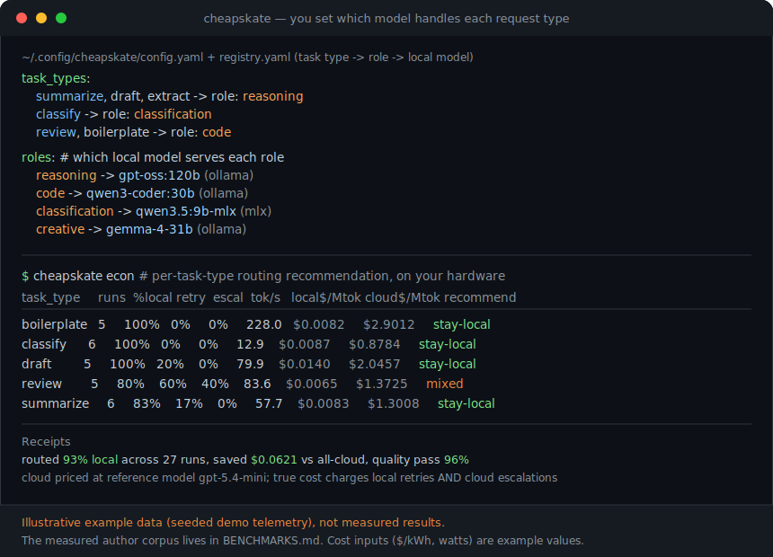
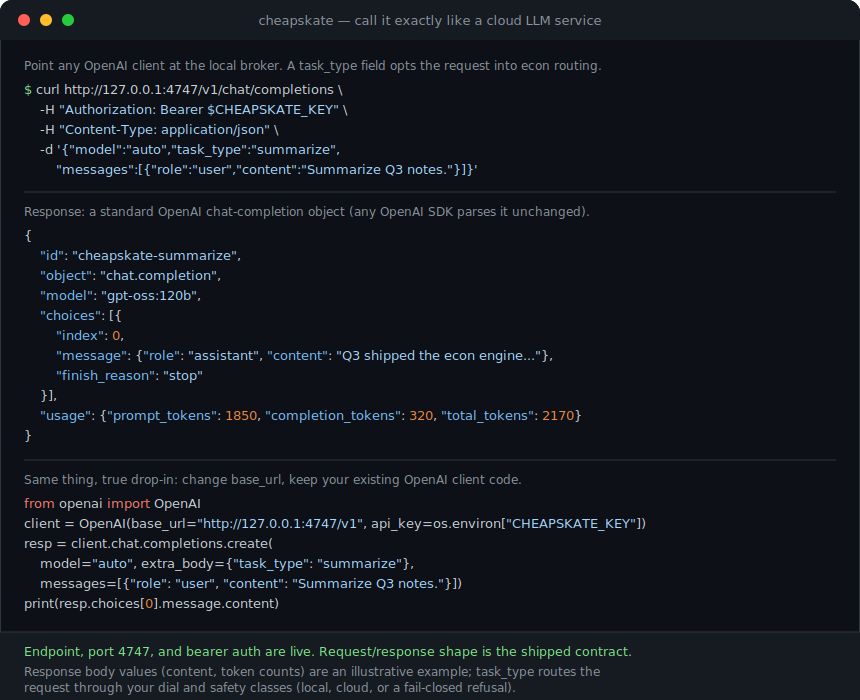

# cheapskate

**Routes every task to the cheapest model that passes your quality bar (local or cloud) and
shows you the receipts.**

You installed Ollama, you pulled some good local models, and you *meant* to stop paying for the
easy stuff. But wiring "run this locally, escalate that to the cloud, and never send the sensitive
stuff off-box" into every tool is fiddly, and you have no idea how much you're actually saving,
so the local models sit idle and the cloud bill keeps coming.

Cheapskate is the **economics + judgment layer** that sits *above* your serving engines (Ollama,
MLX, LM Studio) and cloud APIs. It is not a gateway and not a serving engine. It decides *where
each task should run* (from a spend dial, per-task-type rules, and hard safety classes), then
measures what that decision cost **on your hardware** and hands you the receipts.



<sub>A real session (qwen3:4b on Ollama). Point a role at a small local model, run one task, read the receipt. The 2-minute version is [below](#route-a-real-task-in-2-minutes-one-small-model).</sub>

## Why I built this

It began as a turf war over one computer. I'd bought a 128 GB Mac to run local models and offload
the bulk work my Claude agents were doing. Meanwhile my son, studying abroad in Sydney, was remoting
into that same Mac over Tailscale to drive its big models from LM Studio on his laptop, half a world
away. A 128 GB box is generous until two people share it: he'd load a model, my jobs would try to
load another, and the machine would thrash or OOM and kill whatever the other person was mid-way
through. We needed a way for several people and several models to take turns on one Mac without
stepping on each other. Once things shared the machine, the next question was whether any of the
local detour was actually paying off, and nothing I could find measured it. So the coordinator grew
a router, an econ engine, and receipts.

There are good tools next to this one: LiteLLM (a cloud gateway), GPUStack (a serving cluster),
RouteLLM (a strong-vs-weak query router), TensorZero (an LLMOps platform). I ran them down before
writing a line. Each solves a real problem, and none of them centers the four things I actually
needed on my own machine:

1. **Memory admission for one box.** Two large local models will not fit in the same unified memory
   at once. Cheapskate has a broker that loads and de-loads models under a single lock, so a routed
   task never OOMs the machine. The serving tools serve; they do not arbitrate memory across a fleet
   of roles on one Mac.
2. **Eval-gated model promotion on *your* hardware.** A credible new local model ships roughly
   weekly. Cheapskate only promotes one into a role if it beats the incumbent on *your* eval set on
   *your* hardware, with the incumbent and a rollback target protected. Model choice becomes evidence,
   not a Reddit thread.
3. **Fail-closed safety classes in both directions.** Some task types must never run on a weak local
   model (financial, legal, medical). Some must never leave the box at all. If a never-cloud task
   cannot run locally, it errors. It does not quietly ship your data off-box. Both directions are
   pinned by tests.
4. **Receipts that count retries and escalations.** Content-free telemetry produces a true cost per
   task type that charges a task for its failed local attempts *and* its cloud escalation, which is
   exactly the accounting most "I saved $X" claims skip.

If you only need one of those adjacent tools, use it. Often the right answer is one of them *plus*
cheapskate owning the where-should-this-run-and-what-did-it-cost decision on top. Full head-to-head
in [How is this different](#how-is-this-different-from-litellm--tensorzero--routellm--gpustack).

> **Status: v0.1, single-author, pre-1.0.** The core, econ engine, cloud tier, eval harness, and
> CI are in place and tested. It routes real work today. Read the [honest limits](#honest-limits)
> before you depend on it.

```
                        ┌──────────────────────────────────────────┐
   your tools           │                cheapskate                │
   (CLI agent,          │                                          │
    cron job,   ─────►  │   spend dial  ─┐                         │
    MCP client,         │                ├─►  router  ─► decision  │
    OpenAI SDK)         │   safety classes┘   (local | cloud |     │
                        │   (never-local /     refuse, fail closed )│
                        │    never-cloud)             │            │
                        │                             ▼            │
                        │   budget governor ◄── econ engine ◄──────┼── telemetry (content-free)
                        │   (per-user caps)     (measured $/task)   │
                        └───────────┬──────────────────┬───────────┘
                                    │                  │
                        ┌───────────▼──────┐   ┌───────▼──────────┐
                        │  serving engines │   │   cloud APIs     │
                        │  Ollama · MLX ·  │   │  OpenAI-compat · │
                        │  LM Studio ·     │   │  Anthropic       │
                        │  remote backends │   │  (BYO key, OFF   │
                        │  (other machines)│   │   by default)    │
                        └──────────────────┘   └──────────────────┘
```

Cheapskate never serves a model itself and never rebuilds a hundred-provider gateway. Serving stays
on Ollama/MLX; the cloud adapters are deliberately thin. It composes with what you already run.

## 10-minute quickstart

Everything below runs offline against the local checkout: no model, no server, no network, no
cloud key. It is the exact path proven from a bare clone on a fresh machine.

```bash
# 1. Clone and install (editable, with the dev/test tooling).
git clone https://github.com/jasonjknapp/cheapskate.git
cd cheapskate
python -m venv .venv && source .venv/bin/activate
pip install -e .[dev]

# 2. Preflight. Reports what's present (Python, dirs, serving engines, ports,
#    pricing-feed age). A missing Ollama/MLX is a WARN, not a failure. A bare
#    clone with nothing running still exits 0.
cheapskate doctor

# 3. Run the suite. No network, no live servers; everything is injected.
make test

# 4. Run the shipped deterministic eval set (the quality gate). Injected/offline
#    by default, so it proves green with no model attached; --live binds the real
#    broker client to gate an actual model.
cheapskate eval
```

`doctor` exits 0, `make test` is green, and `cheapskate eval` prints `"gate": "PASS"`. That is the
whole reproducibility contract: a stranger clones, installs, and proves the harness works before
attaching a single model.

## Route a real task in 2 minutes (one small model)

The offline quickstart proves the harness. This routes an actual task to an actual local model, on
hardware you already have. It uses a ~3 GB model so a 16 GB machine can run it; nothing here needs a
big fleet.

```bash
# 1. Pull one small model (Ollama). ~3 GB.
ollama pull qwen3:4b

# 2. Point a role at it. Create ~/.config/cheapskate/config.yaml:
mkdir -p ~/.config/cheapskate
cat > ~/.config/cheapskate/config.yaml <<'YAML'
roles:
  reasoning:
    model: qwen3:4b
    backend: ollama
    approx_gb: 3.0
YAML
cheapskate models list   # 'reasoning' now shows model qwen3:4b, source: config

# 3. Start the broker. On first run it provisions a local key (mode-600) and
#    prints where it saved it; the CLI and client use it automatically.
cheapskate serve &        # leave it running; Ctrl-C to stop

# 4. Route a real task. It resolves the role to qwen3:4b, runs it locally, and
#    returns the answer with a self-reported confidence.
echo "The Eiffel Tower is an iron tower in Paris, built 1887-1889." > /tmp/note.txt
cheapskate task --task-type summarize \
  --criteria "Summarize in one short sentence." --in /tmp/note.txt

# 5. Read your first receipt: what ran local, and what it would have cost on the cloud.
cheapskate econ
```

Step 4 returns `{"output": "...", "ok": true, "route": "local", ...}`. Step 5 shows a per-task-type
table with the cloud-equivalent cost of what you just ran locally. If a role points at a model you
have not pulled, the broker fetches it on first use (behind a disk/RAM safety gate); disable that
with `machine.auto_pull: false`. If `cheapskate task` reports the broker is unreachable, step 3 is
not running.

## What it looks like

Two things carry the whole idea: you set which model handles each request type, and you call the
result exactly like a cloud LLM.



*You map each task type to a role, and each role to a local model (`config.yaml` + `registry.yaml`);
`cheapskate econ` then shows the per-task-type routing recommendation and what each route costs on
your hardware. Figures above are seeded demo data (illustrative, not measured).*



*Point any OpenAI client's `base_url` at the broker (curl, the `openai` SDK, anything). A `task_type`
field opts the request into econ routing (local, cloud, or a fail-closed refusal); drop it and it is
a plain role/model proxy.*

## The spend dial

Routing policy is first-class, machine-readable state; one setting governs where work goes. Read
fresh on every decision; never cached.

| Dial | Meaning | Behavior |
|---|---|---|
| `0` | cloud-first | send local-capable work to the cloud (you want speed/quality over savings) |
| `1` | balanced | route by per-task-type floors |
| `2` | local-first *(default)* | prefer local; sub-dial `lite` \| `std` \| `max` tunes how hard it leans |
| `3` | local-only | never leave the machine |

```bash
cheapskate dial            # show the current dial + what it means
cheapskate dial set 2:max  # local-first, maximum patience before escalating
cheapskate dial set 0      # cloud-first for a crunch
```

The `2:max` sub-dial tells the verify-and-repair loop to tolerate a retry before escalating; the
other levels escalate fast. The dial is a state file, so a cron job, an editor, and an agent all
read the same policy.

## Receipts + the econ engine

This is the part nobody else packages. Every routed task logs a **content-free** telemetry event
(counts, durations, model, route, ok, never prompt or output text). The econ engine reads that
feed and computes what each route actually cost *on your hardware*:

- **tokens/sec per model per machine**, measured from live telemetry, not a spec-sheet guess;
- **energy cost** via `powermetrics` watt sampling (Apple Silicon) × your `$/kWh`, and honestly
  reports **"electricity unknown"** rather than fabricating a number when it can't sample;
- optional **hardware amortization** ($/month over your horizon), if you choose to model it;
- **cloud prices** from a bundled `pricing.json` (per-row source + `as_of`, refreshed weekly by
  CI, never fetched at runtime), so the local-vs-cloud comparison is against real list prices.

The honest part: the true-cost math **charges retries and escalations**. If a task drafts locally,
fails verification, retries, and finally escalates to the cloud, all of that is counted: the local
attempt was not free. Most "route to save money" tools quietly price only the happy path. The cost
math is deterministic and unit-tested precisely because that is the claim a skeptic will try to
break.

```bash
cheapskate econ            # per-task-type routing recommendation + true $/1M-token table
cheapskate report         # monthly receipts (routed %, quality pass, cost)
cheapskate report --share  # a content-free aggregate receipt, safe to post publicly
```

`--share` reads **only** numeric aggregates, model ids, and your machine id. It never touches a
free-text field, pinned by test so a poisoned telemetry line can't leak into a public receipt.

## Default models + auto-download

Cheapskate ships a **suggested model per role** (a sane starting fleet matched to a roughly 128GB
Apple-Silicon profile), so `cheapskate models list` and `cheapskate econ` render on a fresh install
instead of blank. Each row is marked `"source": "default"` until you pick your own. The first time a
role is actually served and its selected **Ollama** model is not yet pulled, cheapskate fetches it on
demand (`ollama pull`), **gated by the same fail-closed disk/size/RAM budget** as model currency: a
download that would breach disk headroom or the RAM budget is refused, never forced. These are only
suggestions: set `roles:` in `config.yaml` (or promote via the currency engine) to override any of
them, and set `machine.auto_pull: false` to require a manual `ollama pull` (e.g. on a metered
connection). MLX models are not auto-fetched yet (an HF snapshot is more involved than a one-liner);
doctor tells you which defaults are pulled vs not.

## Eval-gated model currency

New local models ship constantly. Cheapskate can auto-discover them (Hugging Face) but only
**promotes** what passes *your* eval suite on *your* hardware, with the incumbent, fallback, and
rollback targets protected from ever being pruned. Stop choosing models by vibes; choose them by
whether they pass your bar and what they cost you per token.

Discovery is global rather than tied to a publisher list. Its shortlist score weights release
recency most heavily, then trending, downloads, and likes; those signals never override the local
quality gate. Managed models can be reclaimed least-recently-used first, but only when they are
eligible and are not an incumbent, fallback, rollback, or pin. A vanished upstream
source does not make an obsolete model undeletable.

## Model-independent jobs and self-healing

Jobs target a role and a `JobContract` (capabilities, output mode, quality floor, repair budget,
and deadline), not a model id. A role request tries its incumbent, then only that role's fallback
and retained rollback. Structured calls repair invalid output for a bounded number of attempts,
then change models; a bad response shape is a job/model incompatibility, not a server outage.
The engine checks `deadline_s + bounded_late_s` before every adapter operation and before accepting
its result. Backend adapters remain responsible for interrupting a single blocking model/install
call at that same deadline; the engine will not leak a worker thread or process to simulate cancellation.

`SelfHealingEngine` is adapter-driven: connect your installed-model probe, discovery, guarded
installer, eval suite, notification sink, and deletion backend. If installed candidates are
exhausted it ranks compatible discovery candidates, installs one behind your fit gate, and retries.
It never silently sends a never-cloud job to a cloud model.

## Safety classes: both directions, fail closed

Two symmetric hard classes, enforced in the router *before* any dial logic runs:

- **`never_local`**: the task must not be answered by a local model, and there is **no silent
  cloud fallback**. It is a hard refusal. Defaults: `financial`, `legal`, `medical`, `credentials`.
- **`never_cloud`**: the task must never leave the machine. If the dial would send it off-box,
  that is a hard error (kept local or refused, never shipped). Defaults: empty (opt-in the task
  types your compliance posture requires).

Both **fail closed**: a `never_cloud` task with the local fleet down errors out. It does *not*
fall back to the cloud. A `never_local` task with no cloud tier configured errors out. It does
*not* quietly answer locally. Pinned by tests in both directions. This is the compliance story:
you can prove a class of work physically cannot leave the box.

## Cloud tier: BYO keys, OFF by default

Thin adapters, not a gateway: `openai-compat` drives any OpenAI-compatible API (OpenAI, OpenRouter,
a Gemini OpenAI-compat endpoint, a local vLLM); `anthropic` drives Claude. Every provider ships
**disabled**; a shipped install reaches the cloud only after you enable a provider *and* set its
`api_key_env` in the environment. Secrets live in environment variables, never in config, never in
the repo.

## Adoption surfaces

- **OpenAI-compatible endpoint.** Point any OpenAI-client tool's `base_url` at the broker's
  `/v1/chat/completions`. A `task_type` extension field opts a request into econ routing; without
  it, it's a plain role/model proxy.
- **MCP server.** `cheapskate mcp` (stdio) exposes `run_task` and `econ_report` to any MCP client
  (a code assistant, an agent CLI; needs the `mcp` extra).
- **Python API.** `cheapskate.client.complete()` / `generate_json()` go through the broker with
  graceful degradation.

**Drop-in kits.** Copy-pasteable offload kits for Claude Code, Gemini CLI, Codex, and any
OpenAI-compatible tool live in [`integrations/`](integrations/): MCP server registrations plus
paste-in instruction snippets that teach the expensive agent to hand its cheap, bulk subtasks
(drafting, classification, extraction, first-pass review, boilerplate) to cheapskate and keep its
own tokens for judgement.

## Multi-machine

**v0.1 (today): remote backends.** A backend entry with a non-localhost URL points at another box's
Ollama/MLX endpoint. The `machine_id` field flows through telemetry and the econ report, so tokens/sec
and watts are tracked per machine. Your desktop can dispatch to the GPU box in the other room today.

**v0.2 (roadmap): the fleet agent.** Remote load/swap and per-machine locks: "your
household is now a fleet." Cheapskate schedules *tasks* across machines; it never shards a model
across them (that's a different tool's lane).

## How is this different from LiteLLM / TensorZero / RouteLLM / GPUStack?

Short version: they are all good at what they do, and none of them measures what a route costs on
your own hardware, gates local-model promotion on your evals, or enforces a never-cloud class. That
combination is the gap cheapskate fills. Be honest with yourself about what you actually need;
often the answer is one of these, or one of these *plus* cheapskate.

| | **cheapskate** | **LiteLLM** | **TensorZero** | **RouteLLM** | **GPUStack** |
|---|---|---|---|---|---|
| **What it is** | Economics + judgment layer above serving engines & gateways | AI gateway / proxy for 100+ LLM APIs | LLMOps platform: gateway + observability + optimization | Query-difficulty router (strong ↔ weak model) | GPU-cluster manager for model serving |
| **Routing basis** | Spend dial + per-task-type rules + safety classes | Load-balance / fallback across configured models | A/B + fallbacks/retries; optimizes prompts & models | Learned router predicts if a query needs the strong model | N/A (it serves; doesn't task-route) |
| **Local models** | First-class (the whole point) | Supported as just another provider | Supported (self-hosted via the gateway) | Supported as the weak model (e.g. via Ollama) | Serves them (vLLM/SGLang cluster) |
| **Measured on-your-hardware econ** (tokens/sec, watts, retries+escalations) | **Yes (the wedge)** | No (prices requests from a cost map) | No (optimization ≠ hardware cost) | No | Meters tokens/utilization, not $/task vs cloud |
| **Eval-gated local model promotion** | **Yes** | No | Has evals, but not for local-model promotion | Ships router evals, not model promotion | No |
| **never-cloud / never-local classes** (fail-closed) | **Yes, both directions** | Guardrails/budgets, not a fail-closed on-box class | No | No | No |
| **Serves models itself** | No (composes with Ollama/MLX/etc.) | No (it's a proxy) | No (it's a gateway) | No | **Yes** (that's its job) |
| **When to use THEM instead** | N/A | You need one API over 100+ cloud providers with per-key spend limits and virtual keys | You want production-metric-driven prompt/model optimization + deep observability | You want a research-grade learned router to auto-pick strong vs weak per query | You're standing up a multi-GPU serving cluster (LLMaaS) |

Compose, don't compete: run your serving on Ollama/MLX or GPUStack, keep LiteLLM if it's already
your cloud gateway (cheapskate can dispatch through an OpenAI-compatible endpoint), and let
cheapskate own the *where-should-this-run-and-what-did-it-cost* decision on top.

*(Competitor positioning verified against each project's own GitHub/docs on 2026-07-11. If a cell
is out of date, it's a bug; open an issue.)*

## Honest limits

Portfolio-grade honesty, because the alternative gets shredded on the first read:

- **v0.1, single author, no SLA.** Issues welcome; response is best-effort. Don't put it on a
  critical path you can't debug yourself.
- **The measured story is about *routing behavior*, not a dollar headline.** See
  [BENCHMARKS.md](BENCHMARKS.md): the author's ~8-day telemetry shows **~76% of real delegations
  served locally** (a bounded broker outage excluded and disclosed), a steep adoption ramp, and
  per-role success/latency. There are **no token fields in that telemetry**, so any dollar figure
  is an explicitly-labeled estimate, not a measured number. The receipts *mechanism* is real and
  tested; big savings claims are yours to generate on your own hardware, not ours to promise.
- **Apple-Silicon-first for energy.** `powermetrics` watt sampling is Apple Silicon; elsewhere the
  engine runs in honest "electricity unknown" mode.
- **Not built (yet):** the v0.2 fleet agent (remote load/swap), a web dashboard (a static HTML
  report from the JSONL is the v0.1 answer), sharded/distributed inference (out of scope, always;
  that's exo's lane), and a hosted service (there won't be one).
- **Single-large-model machines.** The safety semantics (machine-wide flock, de-load before a large
  load, never preempt a running generation) assume you run one big model at a time on a box. That
  matches a MacBook/desktop; a multi-GPU server wants GPUStack underneath.

## Roadmap

- **v0.1 (now):** core routing, econ engine + receipts, cloud tier, safety classes, eval-gated
  currency, remote backends, OpenAI-compatible + MCP surfaces, CI.
- **v0.2:** the fleet agent (remote load/swap and per-machine locks); a community
  hardware-benchmark corpus (see [BENCHMARKS.md](BENCHMARKS.md); PRs open now).
- **Later, maybe:** an interactive local-vs-cloud calculator seeded from published aggregates.
  Explicitly *not* on the roadmap: sharded inference, a 100-provider gateway, a hosted service.

## More

- Architecture and conventions: [docs/ARCHITECTURE.md](docs/ARCHITECTURE.md)
- Security model: [SECURITY.md](SECURITY.md)
- Measured benchmarks + community hardware table: [BENCHMARKS.md](BENCHMARKS.md)
- Contributing: [CONTRIBUTING.md](CONTRIBUTING.md)
- License: [Apache-2.0](LICENSE) (explicit patent grant, deliberate)

Co-created by [Jason Knapp](https://github.com/jasonjknapp) and [Bryan Knapp](https://github.com/Sirnapsalott). Jason writes the code; Bryan drives the ideation, the real-world testing, and the feature roadmap — the turf war in "Why I built this" is his side of the machine.
